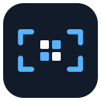

# PixelFit



**让 macOS 外接屏选择合适的 HiDPI 分辨率。** PixelFit 是一个原生菜单栏工具：优先使用系统实际提供的模式，缺少档位时由你明确授权添加缩放配置，不自动启用虚拟镜像。

PixelFit is a resolution-only macOS utility for choosing HiDPI modes. Native modes come first; physical scaling configuration requires explicit authorization, and virtual mirroring is an optional experiment. The release binary targets Apple Silicon on macOS 14 or later.

[下载与发行说明](https://github.com/rockythink/PixelFit/releases) · [兼容性记录](docs/compatibility-matrix.md) · [API 与实现参考](docs/display-protocol-references.md) · [反馈问题](https://github.com/rockythink/PixelFit/issues)

## 下载与安装

1. 打开 [v0.2.0 发行页](https://github.com/rockythink/PixelFit/releases/tag/v0.2.0)，下载该页实际发布的 `PixelFit-v0.2.0-macos-arm64.zip`，不要选择 GitHub 自动生成的源码 ZIP。
2. 解压，将 `PixelFit.app` 拖入「应用程序」。需要 **macOS 14 或更新版本、Apple Silicon（arm64）**；当前不提供已验证的 Intel 安装包。
3. 若使用过旧版 HiDPIBuddy / PixelFit，先正常退出旧版本，再打开新 App。通过菜单栏图标或主窗口选择屏幕。

v0.2.0 的发行附件已使用 Developer ID Application 签名，通过 Apple 公证，并在 App 中附加公证票据；本地 Gatekeeper 验证为 `accepted / Notarized Developer ID`。发行页同时提供 `SHA256SUMS.txt`。源码 ZIP 和自行构建的 App 不等于已公证发行包；若 macOS 阻止打开，请先核对来源、校验值与发行说明，不要关闭 Gatekeeper 或 SIP。

## 日常使用

1. 在屏幕示意图或屏幕列表中选择目标屏幕；示意图显示桌面相对位置，点击只选择屏幕，不改变排列。
2. 在「HiDPI 分辨率」选择尺寸。推荐遵循屏幕物理比例，同一尺寸不会因刷新率重复出现。
3. 检查画面是否铺满、文字比例及刷新率；**15 秒内点击「保留分辨率」**。未确认会自动恢复之前模式，也可手动恢复。

支持保存、应用和删除物理显示器的分辨率 / 刷新率预设，提供中英文界面与系统显示设置入口。重复打开同一包标识的 App 会激活最早启动的实例并退出新实例，避免重复菜单栏图标；只读 CLI 不受此限制。

**只管理分辨率。** 不探测或读写 DDC，不提供亮度、音量、对比度、输入源、电源、色温、Night Shift、同步或定时任务。

### 缺少目标模式：启用更多 HiDPI

目前该入口仅开放给在线、未旋转、未镜像的 **2560×1600 外接屏**，目标为 1600×1000 HiDPI；同规格不代表所有型号都兼容。

1. 点击「启用更多 HiDPI」，核对目标、Vendor/Product ID 和受影响的屏幕。
2. 明确确认后，亲自完成 macOS 管理员授权；取消不会写入配置，安装也不会立即切换分辨率。
3. 可先将外接屏电源关开，再刷新列表；未生效时由你重新连接屏幕或重启 Mac。App **不会自动断开屏幕、模拟拔线或重启**。
4. 只有 macOS 实际注册的 2× 模式才会进入默认选择器；出现后仍需按上述 15 秒流程检查并确认。

配置按 Vendor/Product ID 匹配，影响所有相同 VID/PID 的屏幕，而非仅当前这一台。只写入 `/Library/Displays/Contents/Resources/Overrides`，不写入 `/System`，不修改 EDID 字节或显示器固件，不安装驱动、不要求关闭 SIP。

### 已验证的物理 HiDPI 路径

| 屏幕与环境 | 已验收结果 |
| --- | --- |
| Sculptor，物理面板 2560×1600；Apple Silicon / macOS 27.0.1；DP → HDMI | **1600×1000 HiDPI / 120Hz**，3200×2000 渲染缓冲；无虚拟显示器、无镜像；用户确认铺满屏幕且文字比例正常；15 秒自动恢复、确认保留及原配置恢复通过 |

当前生成格式保留真实面板尺寸，追加 8 字节的双倍渲染宽高；3200×2000 是渲染尺寸，不是新增物理像素。上述新增物理模式的实屏验收仅覆盖 Sculptor，不能推断其他显示器或 macOS 版本也支持。历史失真试验、虚拟路径结果及未验证项目见 [兼容性记录](docs/compatibility-matrix.md) 和 [实现参考](docs/display-protocol-references.md)。

### 高级可选：实验性虚拟镜像

展开「实验性兼容方案」后可手动试用虚拟显示器镜像；它不是默认路径，也不会让系统注册更多物理模式。可能降低刷新率、使文字偏软；会话不存入预设，正常退出 App 时恢复，下次启动不自动重建。强制结束进程或拔线时的恢复尚未实屏验证。

## 恢复配置与卸载

**删除 App 不会自动撤销已安装的系统缩放配置。** 若曾启用「更多 HiDPI」，卸载前请：

1. 结束虚拟镜像，并切换到屏幕原先支持的模式，确认画面正常。
2. 在 App 中点击「恢复原配置」，核对目标并完成管理员授权。它会精确恢复安装前文件；原先不存在文件时，只移除本次安装的产品文件，不删除厂商目录或其他产品。
3. 按需关开屏幕电源、重新连接或重启，再刷新并确认恢复。macOS 可能缓存模式，恢复配置不会立即改变当前分辨率。
4. 正常退出 App 后，再删除「应用程序」中的 `PixelFit.app`。

若提示配置 / 备份冲突，不要强行删除 Overrides 或备份目录。App 会拒绝覆盖第三方修改或不安全的文件；请保留恢复记录，附脱敏诊断反馈问题。

为保留旧预设、语言设置与配置恢复记录，改名后继续使用包标识 `cc.ss-data.hidpibuddy`、原窗口恢复身份、用户数据 `~/Library/Application Support/HiDPIBuddy/state.json` 及管理员备份 `/Library/Application Support/HiDPIBuddy`。恢复成功前不要删除管理员备份；改名本身不改变显示模式或安装系统配置。

## 从源码构建

需要 **Xcode 16 或更新版本（Swift 6，含 Swift Testing）**，并选择对应的 Command Line Tools。运行下限由 `Package.swift` 声明为 macOS 14；没有外部 Swift 包依赖。

```bash
git clone https://github.com/rockythink/PixelFit.git
cd PixelFit
swift test
./script/build_and_run.sh --build
open dist/PixelFit.app
```

`--build` 只构建，不关闭或启动现有 App；产物为 `dist/PixelFit.app`，包含独立的虚拟显示器辅助程序。普通源码构建不写入系统显示配置，也不代表完成 Apple 公证。现有 **36 项常规测试**及已记录的硬件验收范围见 [兼容性记录](docs/compatibility-matrix.md)。

### 构建发布版

发布构建使用 `./script/build_and_run.sh --release`；需通过 `SIGN_IDENTITY` 明确选择钥匙串中有效的 Developer ID Application 证书。该模式构建优化的 arm64 App，先签辅助程序再签 App，开启 hardened runtime 和安全时间戳；缺失或不匹配的证书会在构建前报错，不会退回本地或 ad-hoc 签名。它只构建，不关闭或启动现有 App。

脚本的签名步骤不等于 Apple 公证。维护者还需提交 App ZIP，经 Apple 接受后运行 `xcrun stapler staple` 和 `xcrun stapler validate`，重新打包，并使用 `codesign --verify --deep --strict` 与 `spctl --assess --type execute` 验证。证书私钥和公证凭据不得提交仓库。

只读诊断（选择一种方式）：

```bash
# 已安装的 App
/Applications/PixelFit.app/Contents/MacOS/PixelFit diagnose --all --json

# 源码目录
swift run PixelFit diagnose --all --json
```

CLI 仅提供 `help`、`list`、`status`、`get` 和 `diagnose`；模式切换与管理员配置操作在 App 中进行。

图标源文件为 `Resources/AppIcon.svg`；普通构建使用已提交的 PNG / ICNS。仅修改图标并重新生成资源时，需要 `rsvg-convert`（`brew install librsvg`），再运行 `./script/generate_icon.sh`；打包使用 macOS 的 `iconutil`。

## 兼容性与反馈

- 原生模式枚举使用私有 CGS API，公开 CoreGraphics 模式作为回退；虚拟路径依赖私有 `CGVirtualDisplay` API。系统升级可能改变行为，不代表 Apple 官方支持或 App Store 审核保证。
- 管理员安装 / 恢复依赖系统 `/usr/bin/ruby`，此运行时已被 macOS 弃用；缺失时会在授权前报错，不自动安装或改用 Homebrew 版本。
- 安装成功不等于模式可用；其他系统版本、Intel、内建 / 旋转屏及 AirPlay、Sidecar、DisplayLink 等仍需分别验证。当前 8 字节格式的重启激活亦未单独验收。

提交 [Issue](https://github.com/rockythink/PixelFit/issues) 时，请提供：App 版本、Mac 型号 / 芯片、macOS 版本及构建号、屏幕型号与原生分辨率、连接方式（线缆 / 转接器 / 扩展坞）、当前与目标分辨率 / 刷新率、使用原生还是虚拟路径、准确复现步骤、预期与实际结果，以及脱敏的诊断输出。画面问题请说明是否铺满、有无黑边和文字变形；不要仅凭渲染缓冲尺寸认定成功。

**公开前删除**设备序列号、UUID、个人路径、账号 / 凭据，以及截图中的私人内容；不要上传未脱敏的完整系统报告。

## 许可

本项目自有代码采用 [MIT License](LICENSE)，版权署名为 rockythink。保留的 Git 历史中，已删除的硬件控制实现仍有上游版权义务，见 [第三方声明](THIRD_PARTY_NOTICES.md)；这些历史项目不是当前 App 的捆绑依赖，MIT 不替换第三方版权。
